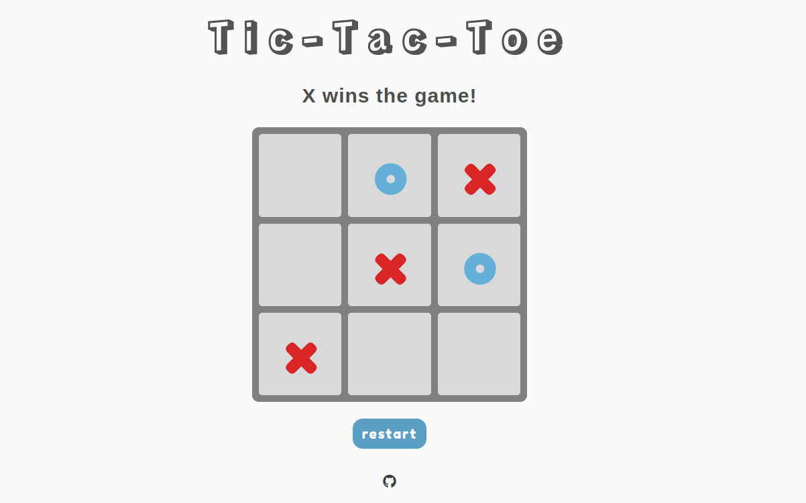

# Tic-Tac-Toe
## Introduction

This project is a webpage that  presents a TTT game in the browser. It is built using the standard front-end stack of HTML, CSS and JavaScript.

The project demonstrates use of factory functions and module pattern to organize and encapsulate JS code. 

## Preview

## Media credits:

1. Flaticon: https://www.flaticon.com/free-icons/tic-tac-toe